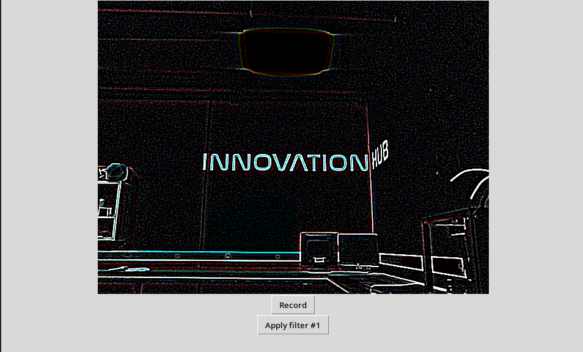
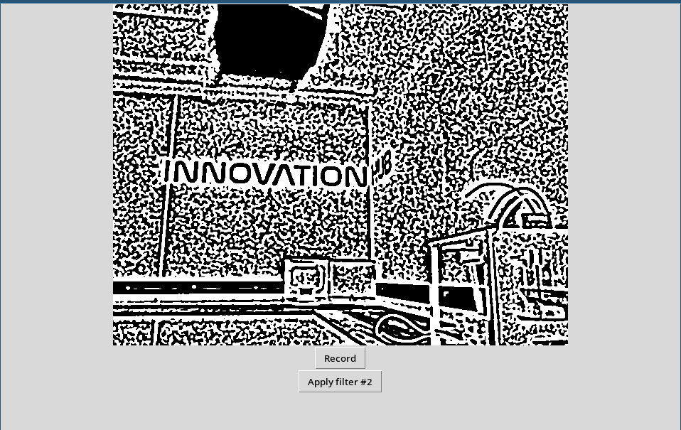
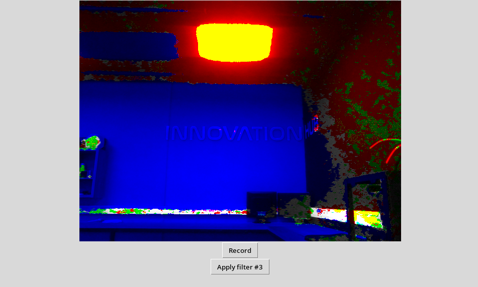
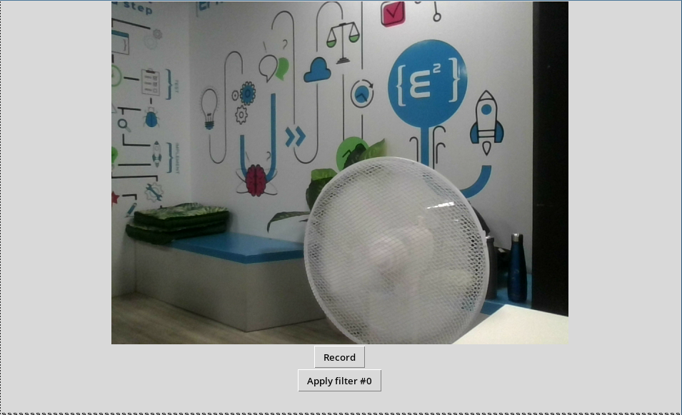
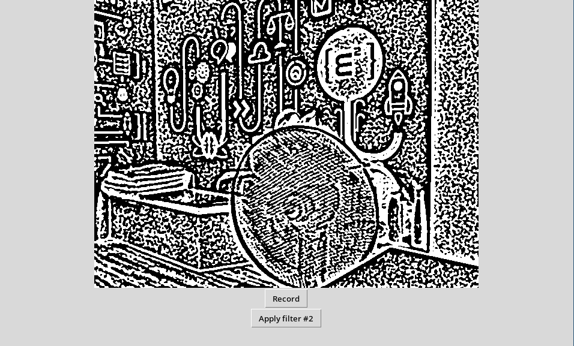

# WatSnap

## Introduction

<br>

### Aujourd'hui, vous allez programmer votre propre interface graphique qui avec des différentes options qui change en direct le filtre sur votre caméra.
<br><br>


### Voici les différents filtres que vous pourrez implémenter






<br><br><br><br>


### Et pour les plus aguerris d'entre vous, vous pourrez générer des fichier gif animés avec votre webcam et les sauvagarder comme ci-dessous : 


<br><br><br><br>

## Etape 00

### Pour commencer ce Coding Club, il faut definir quelques notions importantes.
### Un paramètre est une variable qui peut être modifié par l'utilisateur.
```PYTHON
root = tk.Tk()

# Ici, width est un paramètre qui pernet de définir la largeur de l'interface a 100 pixels
element = tkinter.Label(root, width=100)

# Il y a plein d'autres paramètres comme text, command, etc...
```
### `text=""` &nbsp;&nbsp;est un paramètre qui permet de définir le texte d'un élément.
### `command=fonction` &nbsp;&nbsp;est un paramètre qui permet de définir une fonction qui sera appelée quand l'utilisateur cliquera sur le bouton.
<br>

### Ensuite,  il y existe des variables qui peuvent être modifiées n'importe ou dans le programme. Il s'agit des variables globales.
```PYTHON
my_variable = 0

def my_function():
    my_variable = 1
    # Ici, my_variable vaut 1 uniquement dans la fonction

def my_other_function():
    global my_variable
    my_variable = 2
    # Ici, my_variable vaut 2 dans tout le progamme
```
### Pour finir avant de commencer le coding club, il faut savoir que pour ajouter des elements dans une liste (array), il existe la methode `append()`.
```PYTHON
my_list = []
my_list.append(1)
my_list.append(2)
my_list.append(3)
# Ici, my_list vaut [1, 2, 3]
```


## Etape 01

<br>

### Le but de l'étape 1 est d'ouvrir votre interface et d'afficher vos différents boutons.
### Le Label aura comme texte `"Webcam Video"` et les boutons auront comme texte `"Record"` et `"Apply filter"`.

<br>

### Pour afficher des éléments avec tkinter, il faut utiliser la méthode `pack()` comme ci_dessous.
```PYTHON
root = tk.Tk()

element = tkinter.Label(root)

element.pack()
```
<br>

### Maintenant si vous lancez votre programme, rien ne se passe ! C'est normal, il faut ajouter une boucle infinie pour que l'interface reste ouverte.
```PYTHON
root = tk.Tk()

element = tkinter.Label(root)

element.pack()

root.mainloop()
```

### Comme vous pouvez le constater, il n'y a pas de texte dans le label et les boutons, il faut donc leur en donner un.

### Rappel : Souvenez-vous des paramètres (etape 00).

<br>

## Etape 02

### Le but de l'etape 02 est d'afficher votre premiere image sur le programme.
### Pour cela, vous allez devoir utliser une fonction permettant d'afficher une image sur une interface graphique.

### Completez les trous `...` dans le code pour afficher l'image sur votre interface.
<br> 

### Vous devriez obtenir le résultat suivant:


### Maintenant, afin d'avoir une suite d'image fluide (plus couramment appele une video), vous allez avoir besoin de la methode `after()` qui permet d'appeler une fonction apres un certain temps.
```PYTHON
root = tk.Tk()

# Cela appellera la fonction my_function apres 100 millisecondes
root.after(100, my_function)
```

## Etape 03

### Le but de l'etape 03 est d'appliquer un filtre sur votre video. Pour cela, vous allez devoir utiliser les boutons que vous avez créé dans l'etape 01 en leur attribuant des commandes.

### Rappel : Souvenez-vous des paramètres (etape 00).

### Une fois que vous avez fait cela, completez la fonction `apply_filter()` pour qu'elle applique un filtre sur votre video selon le clique sur le bouton.

### Rappel : Souvenez-vous des variables globales (etape 00).

### Vous devriez obtenir le résultat suivant:


## Etape 04

### Le but de l'etape 04 est d'enregistrer votre video en gif. Pour cela, vous allez devoir utiliser la fonction `save_anim()` qui est deja créée (meme si il faudra completer quelques trous).

### Rappel : Souvenez-vous de tout ce que vous avez fait (etape 00).

<br><br>

# Bravo, vous avez fini le coding club ! <br> Maintenant, nous vous proposons d'ajouter differents bonus

## Bonus 01

### Créer une nouvelle fenetre pour indiquer que le gif est terminé.

## Bonus 02

### Laissez faire votre créativité et ajouter ce qui vous semble le plus interessant.